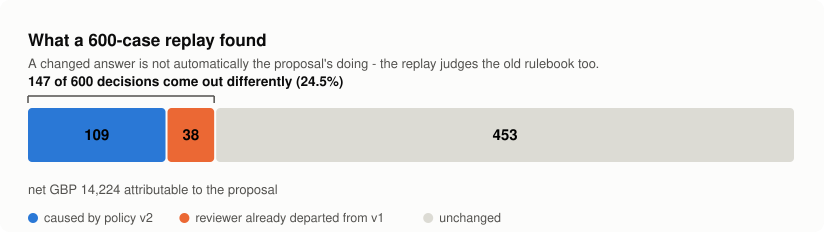
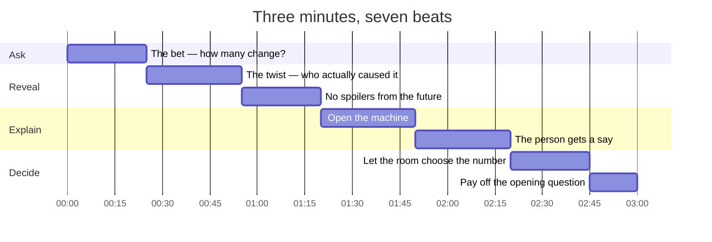
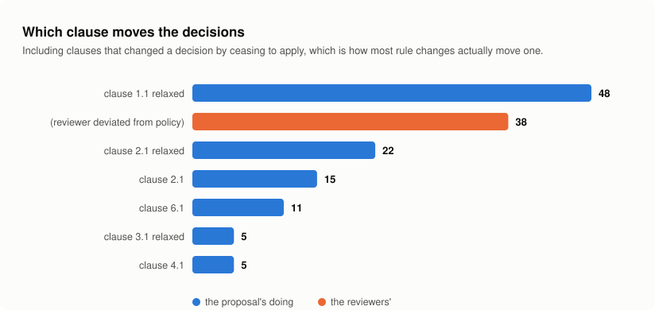
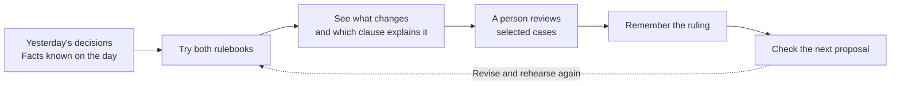
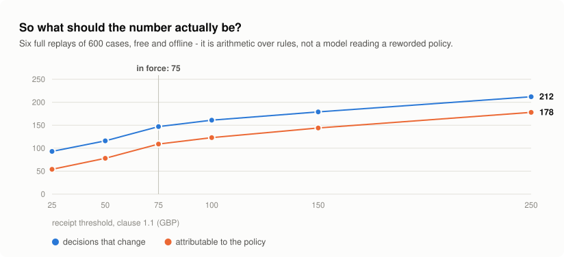
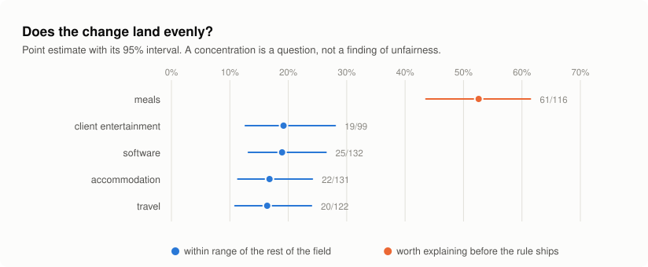
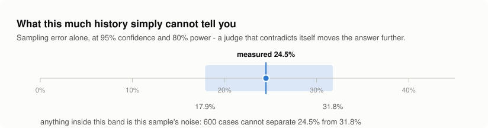

# A rule walks into a time machine

A three-minute demo for people who care about decisions, not DAG syntax.
The audience's question throughout: **“Would you ship this rule?”**

<picture>
  <source media="(prefers-color-scheme: dark)" srcset="docs/charts/story-dark.svg">
  
</picture>

**That bar is the whole demo.** Everything below is the three minutes it takes
to earn each of its three numbers in front of a room.

## The run of show



| Beat | On screen | The one thing they should leave with |
|---|---|---|
| **0:00** The bet | Dashboard, prediction slider | 147 of 600. Almost one in four. |
| **0:25** The twist | Attribution, clause 1.1 | 38 of them were never the proposal's doing. |
| **0:55** No spoilers | Terminal, `ptm.pit_check` | Use today's facts and 39 answers are wrong. |
| **1:20** The machine | Engine room diagram | Rewind, try both, ask a person, remember. |
| **1:50** The person | Human rulings, the gate | Their answer becomes a check the next proposal faces. |
| **2:20** The number | Threshold sweep | The choice is a curve, not an argument. |
| **2:45** The payoff | Impact summary | *Would you ship this rule?* |

Cut in this order if you overrun: the threshold vote at 2:20, then the
point-in-time check at 0:55. Never cut 0:25 — the twist is the demo.

## Set the stage

Start Docker, then run `docker compose up --build -d`. Once Airflow is ready,
open [the dashboard](http://localhost:8080/ptm/?domain=expenses&version=v2) and
[Airflow](http://localhost:8080). The included demo permits access without login.

Prepare results before presenting. Run `python demo.py --setup --step` the first
time, then `python demo.py --step` for rehearsals. It writes offline results to
`include/ptm.db`; the compose setup mounts that directory for the dashboard too.

To show Airflow doing the replay itself, run this beforehand and wait for completion.
New DAGs start paused, and a paused DAG's backfill runs stay queued, so everything is
unpaused - the replay last, once its backfill exists, because the demo's SQLite
metadata database cannot take the backfill's inserts while runs are already writing
(`make demo` does all of it):

```bash
docker compose exec airflow airflow dags unpause adjudicate_expenses
docker compose exec airflow airflow dags unpause precedent_gate_expenses
docker compose exec airflow airflow backfill create --dag-id replay_expenses --from-date 2024-09-01 --to-date 2026-09-01 --run-backwards
docker compose exec airflow airflow dags unpause replay_expenses
```

Keep expenses / v2 selected in Plain summary, a terminal ready, and browser zoom comfortable for
the back row. Verify the counts before recording: persisted rulings or modified
fixtures can change them. Narrate what the screen actually shows.

**Say once:** “This is synthetic demo data. The offline judge uses deterministic
rules, and the local self-test simulates the reviewers. In a live workflow,
people answer the review requests.” No model call or API key is needed.

## 0:00–0:25 · The bet


**Show:** the dashboard's opening question and **Place your prediction**.
Keep the impact chart below the fold until the audience has guessed.

> “We're thinking about changing our expense rules. Before we announce anything:
> how many old decisions do you think would get a different answer? Ten? Fifty?
> Half of them?”

Pause for a guess. Move the slider to the room's prediction and click
**Compare my guess**. Then scroll to the impact chart. The slider is a guess,
not a policy setting; the reveal uses the selected replay's actual counts.

> “In this demo, 147 out of 600. Almost one in four. That small rule change just
> became a much more interesting conversation.”

## 0:25–0:55 · The plot twist


**Click:** **Find the cause**. Point to clause 1.1 and the deviation row.

> “Which sentence did it? This receipt clause accounts for 48 changes. But
> there's a twist: 38 of the 147 differences also disagree with the old rulebook.
> The proposal didn't create those differences.”

> “We're separating the effect of a new rule from the mess already there.”

Say “different answer”; explain once that the tables call these “flips”.

<picture>
  <source media="(prefers-color-scheme: dark)" srcset="docs/charts/attribution-dark.svg">
  
</picture>

If you need one slide for this beat, it is the one above: the second bar is not
a clause, it is the reviewers, and it is the second largest thing in the chart.

## 0:55–1:20 · No spoilers from the future


**Show:** the terminal. With the project's virtual environment active, run:

```bash
python -m ptm.pit_check
```

> “Imagine someone was promoted last year. Should today's seniority change what
> they were entitled to two years ago? This replay uses what was known on the
> day. Using today's facts gets 39 of these 600 cases wrong.”

Let the result sit for a beat. These numbers apply to the shipped expenses fixture.

## 1:20–1:50 · Open the machine



That loop is what **Look under the hood** draws on the dashboard. Trace it with
the pointer while you say the four sentences below; do not read it out — the
diagram already says what it says, and faster than you can.

**Click:** **Look under the hood** on the dashboard.

Trace the four boxes: remember, rewind, ask a person, check again.
Open **Open the engine room** for the diagram of workflows, shared memory,
and the dashboard. Trace it from top to bottom with the pointer.

> “Bring back the old facts. Try both rulebooks. Ask a person about selected
> changes. Save their answer so the next proposal has to face it too.
> Airflow coordinates those steps.”

If someone asks where the chart comes from: “The machine stores the evidence
in one shared memory. This screen reads it back so we can discuss it together.”

For a technical audience, briefly show the monthly runs in Airflow.

## 1:50–2:20 · The person gets a say


**Click:** **Meet the human decisions**. Point to a ruling and its reason.

> “We don't ask someone to read 600 cases. The demo selects eight. Each answer
> becomes an example future rules are checked against. If a proposal reverses
> one, the check fails and somebody has to resolve it.”

Point to the gate's baseline comparison if available.

> “And we still ask whether the old policy already made the same reversal.
> A red result needs an explanation, not a convenient scapegoat.”

If showing an actual Airflow review request, identify it as awaiting a real person;
do not present simulated rulings as live reviewer activity.

## 2:20–2:45 · Let the room choose


**Switch to Full detail. Show:** **Where should the threshold be?** Select the expenses receipt threshold
(clause 1.1, `amount_gbp`), enter `25,50,75,100,150`, and click **Sweep**.

> “What would you choose: 50, 100, or 150 pounds? We can compare the consequences
> before we pick. These results use the offline rules; they show trade-offs,
> not a recommendation.”

Ask for one vote, then point to that setting's result. Keep the caveat visible.

<picture>
  <source media="(prefers-color-scheme: dark)" srcset="docs/charts/sweep-dark.svg">
  
</picture>

**If the dashboard is unavailable,** this chart is the beat. It is the same
sweep, drawn from the same fixture — `make charts` regenerates it, and the
suite fails if it has stopped being true.

**If somebody asks whether the curve is the whole story,** it is not, and that
is worth thirty seconds you do not have: a single sweep holds every other
threshold still and never says so. `make grid` moves two at once. Keep it for
the Q&A.

## 2:45–3:00 · Pay off the opening question

**Show:** the impact summary again.

> “Would you ship this rule? Now we can discuss who it affects, what it costs,
> and which human decisions it must respect. Try tomorrow's rules on yesterday's
> decisions—before tomorrow becomes a surprise.”

**The two slides for the questions that always come.** *Who does it land on?*
and *how sure are you?* — neither belongs in the three minutes, and both are
asked within a minute of finishing.

<picture>
  <source media="(prefers-color-scheme: dark)" srcset="docs/charts/segments-dark.svg">
  
</picture>

> “One category moves more than the rest and four do not. That is a question
> somebody should be able to answer before the rule ships — it is not a finding
> of unfairness, because categories differ in what they contain.”

<picture>
  <source media="(prefers-color-scheme: dark)" srcset="docs/charts/power-dark.svg">
  
</picture>

> “And this is the one that runs before you spend anything. Two years of
> expense decisions cannot separate 24.5% from 20%. If the next version lands
> inside that band, we have not measured a change — we have measured the
> sample.”

## Keep the show moving

- Rehearse with `python demo.py --step`; Enter is your scene change.
- If the site is unavailable, show the offline tour and explain that it exercises
  the engine, not the Airflow UI. A fresh `--setup` needs internet for dependencies.
- If short on time, cut the terminal check and threshold vote. Keep the impact,
  attribution twist, and human decision.
- If asked about AI drafting, explain that proposals can be drafted and checked
  against rulings. Passing that check is not approval; adoption is a human action.
- End on the audience's decision, not a list of libraries.

---

## Director's notes

- **One take per section, then cut.** Three minutes is tight, the sections are
  independent, and there is no prize for a single take.
- **Do not narrate what is on screen.** Say what it *means*. The screen already
  says what it says, and it says it faster than you can.
- **Silence is a tool.** The beats after the audience's guess, after the
  thirty-eight, and after the threshold vote are doing more work than any
  sentence around them. One full second. It feels like ten from behind the
  microphone and reads as deliberate on playback.
- **`make up` finishes before you hit record.** A container starting is thirty
  seconds of nothing, and thirty seconds is a sixth of the film.
- **Cut, in this order, if you overrun:** the threshold vote (2:20), then the
  point-in-time check (0:55). Keep the attribution reveal at 0:25.
- **If the wifi dies, everything above still runs.** That is deliberate, and if
  it happens live it is worth saying out loud.

### When the demo gods intervene

| It breaks | You say | You do |
| --- | --- | --- |
| Backfill grid slow to paint | *"Let's replay the story in the terminal."* | Switch to the prepared terminal and run `python -m ptm.selftest` |
| No HITL task waiting | *"this is the queue it raises"* | Show the DAG graph instead |
| A panel is empty | *"that DAG hasn't run in this environment"* | Move on — the panel names the DAG, so do not read it aloud |
| The gate is red | *"and that's the point — it fails on a reversal"* | Nothing. It is supposed to fail on the shipped fixture |

That last row is not a save. `ptm.gate expenses v2` fails on the shipped data
because policy v1 reverses the same two rulings, and the proposal introduces
neither. A red gate on camera is the feature working. Know that cold, because it
is the one thing a sharp judge will ask about.


## Inspect the evidence behind a result

Open **Replay coverage and evidence** to show how many imported cases were replayed
and whether the saved inputs are still current. In the detailed view, use case
search and the page controls, then click **Review** on a changed case. Show the
historical facts, the baseline and candidate clauses, and the human ruling history.
The review dialog links to the Airflow workflow where a reviewer records a ruling.

For a separate import demonstration, run `python manage.py import expenses
examples/expenses.csv`, inspect the preview, then repeat with `--write`. Follow
with `python manage.py replay expenses v2` and `python manage.py coverage expenses v2`.
These commands default to `include/history.db` and leave the tour database alone.
