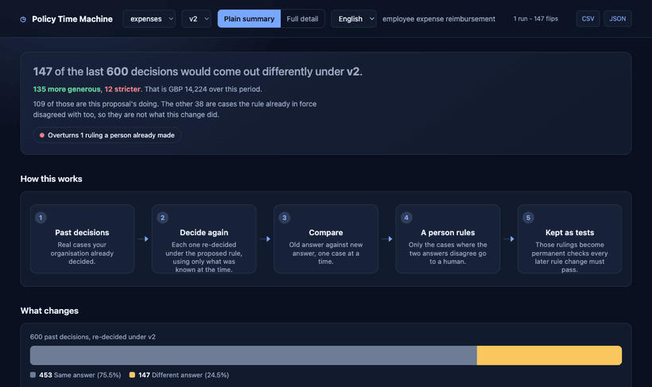
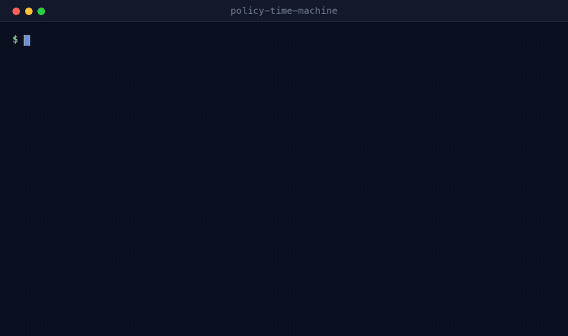
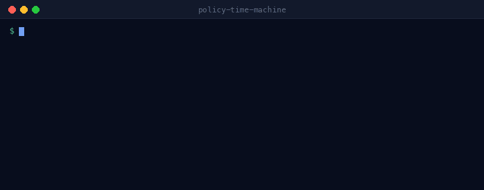
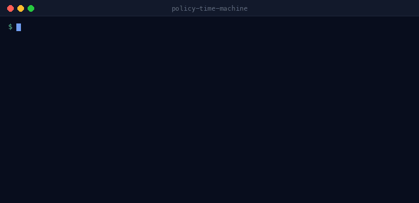
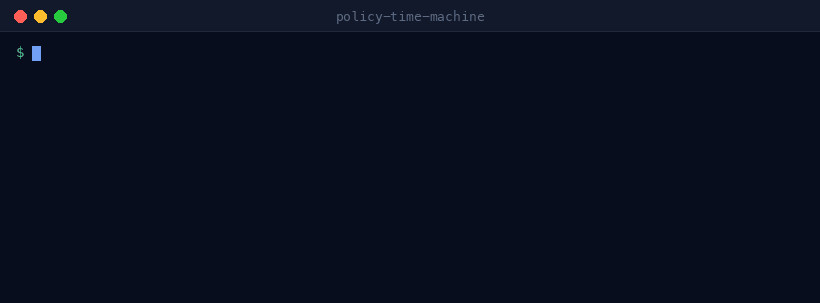
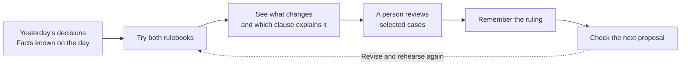
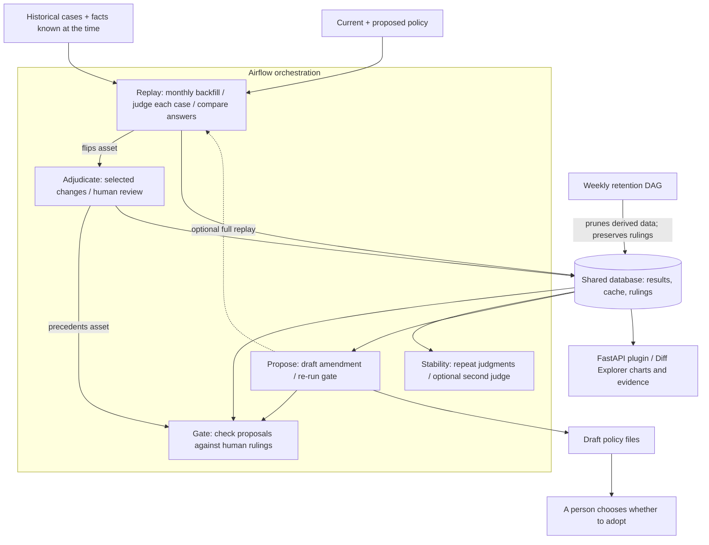

# Policy Time Machine

### Try tomorrow's rules on yesterday's decisions.

**Would you ship a new expense rule without knowing who gets a different answer?**
Take it for a spin first: rewind the past, compare the answers, and ask people
to settle selected cases. Their rulings become checks for the next proposal.

## The 30-second story

| In the included demo | What it means |
|---|---|
| 600 historical decisions | Two years of synthetic expense cases get another look. |
| 147 different answers | Almost one in four recorded decisions would change. |
| 109 changes attributed to the proposal | The other 38 differ from the old rulebook too. |
| 8 simulated human rulings | Selected cases become checks future proposals must face. |

**The twist:** a changed answer does not automatically mean the new rule caused it.
The replay checks the old rulebook too. These are fixture results, not evidence
from a live organisation. The offline demo uses deterministic rules instead of
a live AI judge, and the local self-test simulates reviewer responses.

## Take it for a spin

```bash
python demo.py --setup --step   # first run: install dependencies, pause between scenes
python demo.py --step           # next time: press Enter to move the story along
```

Use `python3` on macOS/Linux if needed. The tour writes demo results to
`include/ptm.db` and exports JSON files in the project directory. No API key needed.

For the website and Airflow workflows, start Docker and run
`docker compose up --build -d`. Once ready, open the
[Policy Diff Explorer](http://localhost:8080/ptm/). Start with the impact chart,
follow the cause of a change, then look at the human rulings.

**Give the room a turn at the controls.** Use **Place your prediction** to guess
the percentage of decisions that change, then click **Compare my guess**.
Follow **Find the cause** for the reveal. Under **Look under the hood**, open
the engine room to see how the workflows, shared memory and charts connect.
The prediction is just an audience activity; it does not change the replay.

**Choose your route:** [Three-minute demo](DEMO_SCRIPT.md) ·
[Architecture](#architecture) · [Technical background](docs/DESIGN.md)



Every organisation has rules that humans apply to messy cases — refunds,
claims, lending, moderation, admissions, expenses. Somebody proposes changing
one, and the honest answer to *"what will this actually do?"* is **nobody
knows**. People argue from anecdote, ship it, and find out in three months.

This makes that question computable, and then makes the answer *stick*.

**Every clip below is the real tool, on the shipped fixture, with no API key.**
Nine of them. The long version of any of it — why each number carries the
caveat it carries, and what each one refuses to claim — is in
[docs/DESIGN.md](docs/DESIGN.md).

---

## 1. A rule change is accused of 147 crimes



`python -m ptm.selftest` — the whole loop, no Airflow, no key, three seconds.
600 synthetic decisions replayed under the proposed policy; 147 come out
differently.

**"147 change" is not actionable. *Which sentence do I edit?* is.** So every
change is attributed to the clause responsible — including clauses that changed
by *ceasing to apply*, which is how most rule changes actually move decisions.

And then the line that costs the most to produce and matters most:

```
109 of 147 changes are caused by policy v2 (net GBP 14,224).
38 are cases the recorded outcome got wrong under policy v1 too,
so they are not this proposal's doing.
```

38 of those 147 are a reviewer departing from the rulebook they *already had*.
Charging them to the new proposal overstates it by 26%. Separating them means
judging the policy in force as well — which is why the replay judges both
sides, and why the bill doubles.

## 2. Do it the obvious way and 39 answers are wrong


The fixture promotes half the employees to grade 3 partway through the period.
The proposed policy exempts grade 3+ from receipts. Join *today's* grade onto
historical cases — which is what every hand-rolled backtest does — and you
approve claims from before those promotions ever happened.

Every one of those 39 errors flatters the proposal. They are **all** in the
loosening direction, which [the test suite asserts](tests/test_point_in_time.py),
because a naive backtest does not add noise — it adds bias. Airflow's
data-interval semantics are the thing that stops it.

## 3. Read the policy before you pay to replay it


A full LLM-backed replay of the fixture is about USD 2, or USD 4 with the
baseline pass. The failure worth avoiding is not an expensive run — it is an
expensive run whose output nobody can use, because a third of the cases came
back as `(no clause applies)`.

That finding is real, and it is in the policy this repository ships. v2's
discretion clause says *"Unchanged from v1."* — and a judge shown only v2 has
nothing whatsoever to apply.

## 4. So what should the number actually *be*?



Attribution stops at *clause 1.1 accounts for 48 of them*. The question that
always follows is *then what should it say?* — and a clause like "receipts
required above GBP 75" has exactly one dial on it. `ptm.sweep` turns it.

Free, offline, six full replays: it is pure rule evaluation over cases already
on file.

## 5. One curve holds every other dial still, and never says so



*"At 100 you get 161 flips"* reads as a property of clause 1.1. It is a
property of clause 1.1 **given where everything else is sitting** — and policy
thresholds are exactly where that breaks, because an exemption and the
restriction it carves out of interact by construction.

So move two at once. The grid reports its own worth on the last line: if the
second dial changed nothing about the first one's effect, two curves said
everything, and it says so rather than letting itself be looked at out of habit.

## 6. Then have it write the sentence



The sweep narrows it to a number. Attribution narrows it to a sentence. Nobody
has yet done the actual work, which is to open the markdown and write the
sentence differently — so `propose_<domain>` does, via `LLMOperator` with
`output_type=PolicyPatch`: clause-level edits, each tied to the evidence that
motivated it.

**Why letting a model write here is not the usual bad idea.** It is not asked
to judge anything, and nothing it produces is believed. It is a proposal
against an oracle that already existed and that it does not get to influence —
which is the next clip.

## 7. The oracle: a regression suite for organisational judgment


147 flips become 8 human decisions. A `HITLOperator`, deferred in the
triggerer, asks a named reviewer not *yes/no* but **what the correct outcome
is** — and why. Those answers are precedent, and precedent is permanent.

From then on, every candidate policy is re-judged against every ruling, and a
reversal fails the run. The gate also judges the policy **in force**, so a
reversal the status quo already makes is not billed to the proposal — in the
run above, the proposal introduces none of them. Three exit codes, and the
third is the one that matters: 0 passed, 1 failed, **2 could not be run**.

The first run gives you an estimate. Every run after gives you a regression
suite.

## 8. Is that the policy, or is that the model?

Before a flip is put in front of a human it is judged again, several times. One
that will not reproduce is the model changing its mind rather than the policy
moving, and it is **held out of the queue** — because precedent is permanent
and writing model noise into it is not recoverable.

```
re-judged 25 flips 3x each under the same policy
  23 reproduced, 2 did not
    exp-0207: approve x2, partial x1, recorded 'approve'
    exp-0411: deny x3, recorded 'partial'
```

*(That block is what a real judge looks like. The offline judge is
deterministic and confirms everything, which it says out loud — see the caveats.)*

Three more checks stack on top, and each answers a question the last one can't:
a **second model** run through the same connection (`--conf
'{"compare_model":...}'`) — independent, not correct, and where two judges
split, *that disagreement is the finding*; the judge scored against the humans
who ruled (**accuracy, with a band, and whether its confidence predicts
anything at all**); and a **concentration check**, because *is this change
landing on one group?* is the first question compliance asks and twelve rows of
percentages is exactly the shape of information a room skims past.

[The design notes](docs/DESIGN.md#consistent-is-not-the-same-as-right) have all
four in full, including what each refuses to claim.

## 9. And what this history simply cannot tell you


Every other band in this project is retrospective. This is the one that runs
*before* you spend anything — and the useful line is a refusal. Two years of
expense decisions cannot separate a 24.5% flip rate from a 20% one. A version
comparison that turns on four points is a comparison about sample size.

It sits under the tiles in the Explorer and in the export bundle, because the
place it is needed is next to the figures somebody is about to argue from.

---

## Why this is an Airflow project

Not "an LLM in a DAG". Every capability here is load-bearing.

| Airflow capability | What it does here |
|---|---|
| **Backfill** | Is the simulation engine. One `backfill create` fans out monthly runs that replay two years of synthetic decisions. |
| **Data intervals** | Make the replay *honest*. Each run only sees cases inside its own window, and each case is hydrated with facts known on its decision date. Skip this and 39 of 600 cases come out wrong — clip 2. |
| **Dynamic task mapping** | One judge task per case, with concurrency capped so you don't melt the model endpoint. Doubled when the baseline pass is on. |
| **Common AI provider** | `LLMOperator` with `output_type=Verdict`, so every verdict is typed, not parsed out of prose. `usage_limits` caps spend per task. The vendor lives in a connection — switching models never touches DAG code. |
| **HITL operators** | `HITLOperator` deferred in the triggerer, holding no worker slot, asking a human for the *correct outcome* — not a yes/no. Addressed to named reviewers, with a notifier and a response timeout; a review the clock answers is refused rather than written into precedent. |
| **Assets** | `ptm://<domain>/flips` wakes adjudication; `ptm://<domain>/precedents` wakes the regression gate. Nothing is polled. |
| **Plugin (FastAPI + external view)** | The Policy Diff Explorer, a tab inside the Airflow UI: a plain summary for the person whose rule it is, the full evidence one click behind it. |
| **Dynamic DAG generation** | Drop a YAML in `include/domains/` and five new DAGs appear. The DAG code contains zero domain knowledge — [a test asserts it](tests/test_dags.py). |
| **Structured generation** | The same `LLMOperator`, pointed the other way: `output_type=PolicyPatch` has a model *write* the next version of the policy, which the precedent gate then re-judges — clip 6. |
| **`model_id` per run** | The second judge. One connection, the model overridden at trigger time, so cross-checking a replay against a different vendor is a `--conf` flag rather than a DAG edit. |

## Architecture

Think of it as a rehearsal studio for rules: the history is the script,
Airflow runs the rehearsal, and people settle the disputed scenes.



The engine room below shows where that story happens. Solid arrows carry
inputs, evidence or workflow signals; the optional replay closes the loop.



Bring the old facts, try both rulebooks, ask a person about selected changes,
and remember their answers for next time. The website reads the stored evidence;
adopting a policy is a separate human action.

Five DAGs per domain, generated from `include/domains/*.yaml`, plus one
`ptm_retention` for the database they share.


`select_for_review` is deliberately stingy: a human sees a flip only if the
judge was unsure, the money is large, or the change makes the organisation more
permissive than it chose to be. Deviations get a reserved *minority* of the
slots rather than the top of the list, because they are reliably the largest
flips by money and would otherwise take the whole queue —
[why that matters](docs/DESIGN.md#what-each-dag-produces).

## Run it

```bash
make up        # Airflow 3.1 at localhost:8080 (no login), history auto-seeded
make demo      # backfill 24 months of replay
make confirm   # re-judge the biggest flips to check each one reproduces
make stability # measure the judge's noise floor
make crosscheck# ask a second model the same questions (needs PTM_OFFLINE=0)
make draft     # have the proposal DAG write the next version of the policy
```

Then open **http://localhost:8080/ptm/** for the Diff Explorer, and the
`adjudicate_expenses` DAG to answer the human-in-the-loop tasks. There is no
login, deliberately — the compose file sets `simple_auth_manager_all_admins`,
which is Airflow's own switch for exactly this situation.

**No Airflow, no API key, whole loop in about a second:**

```bash
make dev       # create .venv with pydantic, pyyaml, pytest, ruff
make test      # style + lint + engine tests + the whole loop, gate included
make preflight # read the policies for problems before paying to replay them
make cost      # forecast a full LLM-backed replay
make sweep     # what should the threshold be?
make grid      # two thresholds at once — one curve cannot show them interacting
make rules     # do the offline rules agree with the judge they stand in for?
make calibrate # is the judge right, scored against the humans who ruled?
make gate      # the precedent regression suite; non-zero if a ruling is reversed
make power     # how big a change could this much history actually detect?
make propose   # draft the next version of the policy (writes nothing)
make export    # everything the Explorer shows, as one file
make vacuum    # drop the rows that stopped earning their disk, and shrink the file
make adopt V=v2-draft1 BY="your name"   # promote a draft into the policy set
```

`make tour` runs the whole thing end to end in about nine seconds. On a box
with no `make` — which is most Windows boxes — `python demo.py` is the same
tour, and `python demo.py --setup` builds the virtualenv first.

**Offline is the default.** `PTM_OFFLINE=1` swaps the `LLMOperator` for a
deterministic rule evaluator declared in the domain YAML; everything else —
the mapping, the diff, the attribution, the HITL gate, the assets, the plugin —
is identical. It exists so the demo survives conference wifi and CI needs no
key. For the real thing:

```bash
PTM_OFFLINE=0
AIRFLOW_CONN_PYDANTICAI_DEFAULT='{"conn_type":"pydanticai","host":"anthropic:claude-sonnet-5","password":"sk-ant-..."}'
```

`make cost` will tell you what that costs first.

## Adding a domain

Nothing in `dags/`, `ptm_dags/` or `ptm/` knows what an expense is. To run this
on insurance claims, moderation decisions, loan applications or admissions:

1. Write the policy versions as markdown in `include/policies/<domain>/`, with
   numbered clauses (`1.1`, `2.1`, …) — that numbering is what attribution
   reports against.
2. Write `include/domains/<domain>.yaml` — outcomes ordered most-generous to
   most-strict, a case template, which version is `in_force`, the
   `segment_fields` you care about, and whether an uneven landing should `warn`
   or `fail`.
3. Load cases into the `cases` table, and any slowly-changing attributes into
   `subject_facts` with a `known_from` date.
4. Run `python -m ptm.lint` before you trust the result — it reads the policies
   as well as the fixtures, so one command covers both halves of the drift.

Five DAGs appear on the next parse. That is the demo's closing move: swap the
config, run the same pipeline on a completely different domain.

## Layout

```
dags/policy_time_machine.py     the file Airflow parses: an index and a loop
ptm_dags/                       one module per DAG — replay, adjudicate,
                                precedent_gate, judge_stability, propose, retention
plugins/                        FastAPI plugin + Diff Explorer dashboard
ptm/                            the engine: config, store, judge, diff, report,
                                stability, calibration, crosscheck, disparity,
                                preflight, sweep, rules, gate, proposal, cache,
                                cost, lint, prune, seed, selftest
ptm/safe_eval.py                computes a rule by walking it, never by eval()
include/domains/*.yaml          the only domain knowledge in the project
include/drafts/<domain>/        policy versions a model wrote, never mixed in
                                with the ones a person did
docs/DESIGN.md                  the long version of everything above
docs/*.gif                      the nine clips, captured from the real tool
tests/                          engine, workflow, API and browser checks
```

The plugin is deliberately nothing but routing — every read model lives in
`ptm/report.py`, so the whole API surface is covered by the test suite without
FastAPI installed. Full file-by-file map, CI checks, and the complete caveat
list: [docs/DESIGN.md](docs/DESIGN.md#layout).

## Caveats

The [full list is in the design notes](docs/DESIGN.md#caveats) — there are
twenty-seven of them, and each one is a claim this project declines to make. The six
that change how you read the clips above:

- **Single-container Airflow on SQLite.** Fine for a demo, not a topology.
- **Offline, several of the checks are inert and say so.** The offline judge is
  deterministic, so stability reports 0% and rule agreement reports 100% — both
  by construction, both printed with that caveat on their own last line. A gate
  that passes because the check is switched off is worse than no gate.
- **The sweep and the grid are fixture arithmetic.** They report what the
  *rule evaluator* would do, not what a model reading a reworded policy would
  do. Free way to narrow a range; then confirm the shortlist with one real
  replay.
- **Judge accuracy is measured on the precedent set**, which is by construction
  the *contested* flips. It does not establish accuracy over all cases,
  and on eight rulings the band is very wide.
- **A segment carrying more of the change than the rest of its field is a
  question, not a finding of unfairness.** Segments differ in what they
  contain. The check never claims otherwise.
- **A drafted amendment is a proposal, not a policy.** Passing the gate tells
  you it reverses no human ruling — not that it is a good rule. Adopting it is
  a separate act, and deliberately a person's.

## License

[Apache-2.0](LICENSE) — the same license as Airflow itself, which is the
ecosystem this is built for.
